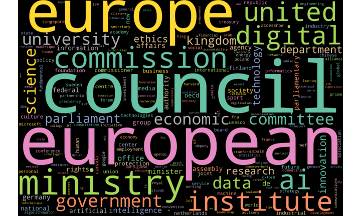
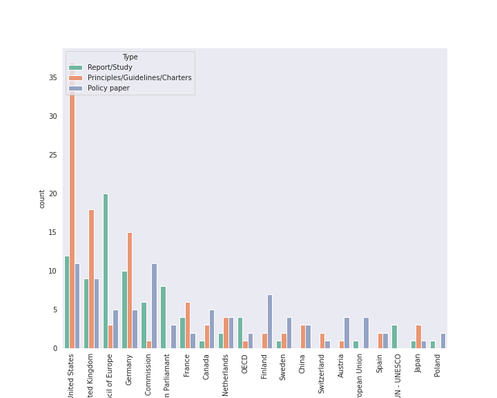
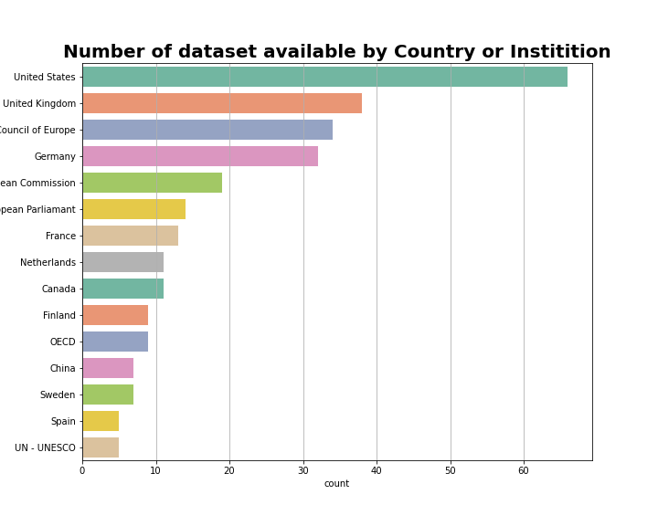

# The-ethics-of-artificial-intelligence-What-talk-data-
Exploring ethical data and finding homogeneous subgroups such that variables in the same group (clusters) are more similar to each other than the others. Based on this clustering, we can assess the global ethic index of Issuer. 

<h1 align=center>The ethics of artificial intelligence: What talk data ? </h1>

<h2 align=center>The ethics of artificial intelligence: What talk data :</h2>

<h3>Author: </h3>

GARBA Moussa, PhD 

<h2>Research Question</h2>

### Objective:

Artificial intelligence refers to systems that can be designed to take cues from their environment and, based on those inputs, proceed to solve problems, assess risks, make predictions, and take actions. In the era predating powerful computers and big data, such systems were programmed by humans and followed rules of human invention, but advances in technology have led to the development of new approaches. Ethics are moral principles that govern a person's behaviour or the conduct of an activity. As a practical example, one ethical principle is to treat everyone with respect. Philosophers have debated ethics for many centuries, and there are various well-known principles, perhaps one of the most famous being Kant's categorical imperative 'act as you would want all other people to act towards all other people' Ethical concerns about these advances focus at one extreme on the use of AI in deadly military drones, or on the risk that AI could take down global financial systems.

Objective: Exploring ethical data and finding homogeneous subgroups such that variables in the same group (clusters) are more similar to each other than the others. Based on this clustering, we can assess the global ethic index of Issuer. 

 
### Aim 1: Clustering for Classification 

### Aim 2: assessment the global ethic index of Issuer 

## Datasets

* [Source Data](https://docs.google.com/spreadsheets/d/1mU2brATV_fgd5MRGfT2ASOFepAI1pivwhGm0VCT22_U/edit#gid=0) - (Issuer, explainability, protection, data ) 
* [Inventory algorithm](https://inventory.algorithmwatch.org/) - (Inventory algorithm)
* [Report study](https://www.europarl.europa.eu/RegData/etudes/STUD/2020/634452/EPRS_STU(2020)634452_EN.pdf - (study report)
* [Report study](https://papers.ssrn.com/sol3/papers.cfm?abstract_id=3518482 - (study report)
* [Report study](https://www.nature.com/articles/s42256-019-0088-2 - (study report)
* [Report study](https://blog.einstein.ai/frameworks-tool-kits-principles-and-oaths-oh-my/ - (study report)
* [Report study](https://fra.europa.eu/en/project/2018/artificial-intelligence-big-data-and-fundamental-rights/ai-policy-initiatives - (study report)

* [Report study](https://duckduckgo.com/- (study report)

## Methodology 

* Aim 1: A Causal Inference Model Based on Random Forests to Identify the Effect of Covid 19 pandemic on economic.
    
* Aim 2:  A Machine Learning Algorithm for Early Detection of country systemic risk. 

    Negative Binomial Regression 
    
## Presentation link 

- [Researchgate](https://www.researchgate.net/project/The-ethics-of-artificial-intelligence-What-talk-data)

## Prerequisites for technical implementation 

- Python 3
- Power Query
- R
- Tableau
